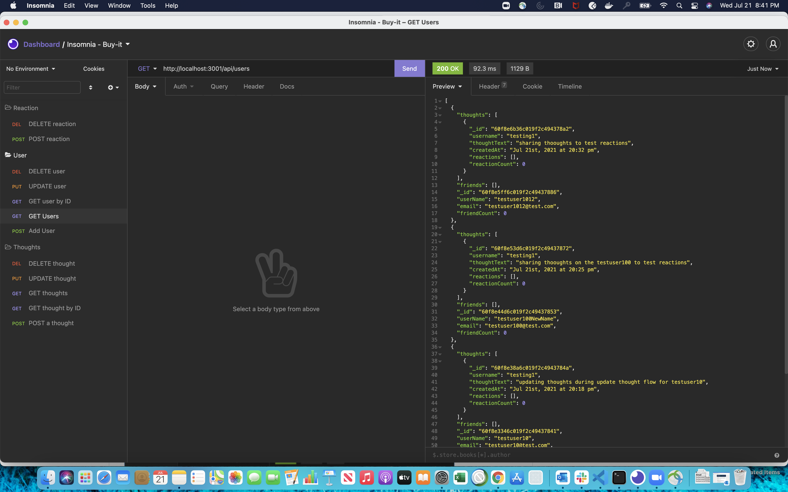
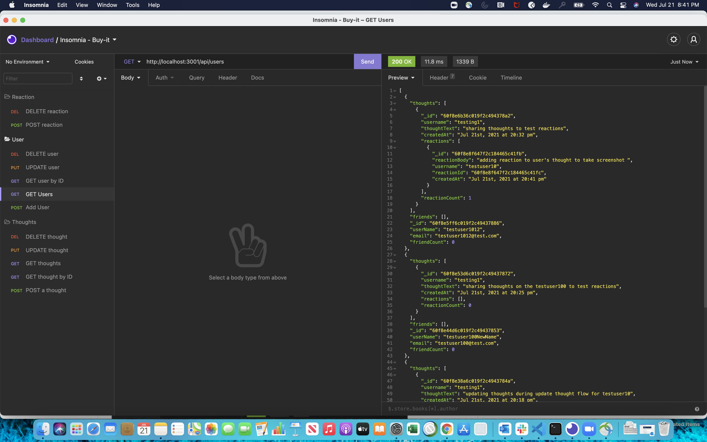
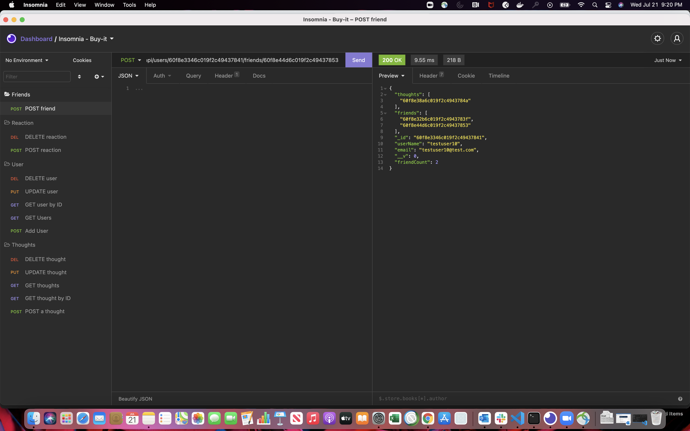

# Social-Network-Backend

API for a social network web application where users can share their thoughts, react to friends’ thoughts, and create a friend list.

# Installation

Clone the repositry from GitHub and open using Visual Studio Code.

# Usage

Demo video link:  https://drive.google.com/file/d/1XaWhML8y0luigB-9fsQGM6xN_tYmpEQW/view

# Screenshots

# Technology

* express JS
* Mongoose

# Questions
[Contact me](chitra.iyer00@gmail.com)

[GitHub](https://github.com/ciyer87)
